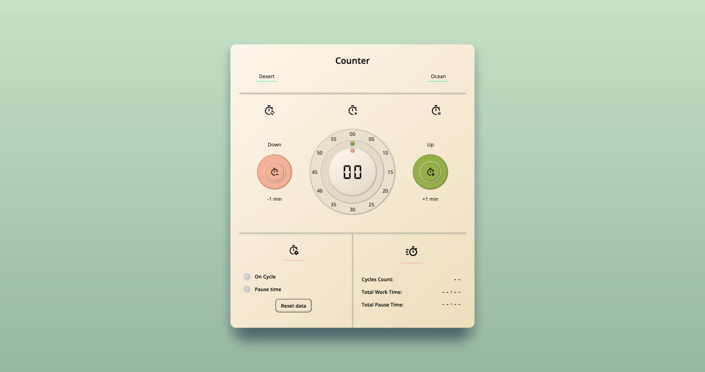

# JS-simple-counter - by MV

Solution to the second practical project of the JavaScript course at [start2impact UNIVERSITY](https://www.start2impact.it): Create a simple application that functions as a counter.

## Table of contents

- [Overview](#overview)
  - [The challenge](#the-challenge)
  - [Screenshot](#screenshot)
  - [Links](#links)
- [My process](#my-process)
  - [Built with](#built-with)
  - [What I learned](#what-i-learned)
  - [Continued development](#continued-development)
  - [Useful resources](#useful-resources)
- [Author](#author)

## Overview

The main task is to create a counter that, with the help of two buttons, allows the user to increase and decrease the counter. Based on this task, the application starts with an adjustable timer that can be configured as a simple timer or a Pomodoro timer.

### The challenge

Main features:

- To decrement or increment the counter (using the +/- buttons, respectively).
- To decrement or increment the timer (using an input that allows the user to directly enter the number).
- To configure the number of cycles that make up a work session.
- To configure the break time between work sessions.
- To display usage data, including the amount of work time, the number of cycles, and the amount of break time.

Extra features:

- Choose from different color themes.
- Select from various skins.
- Access 'help' and tooltips to facilitate the use of the app.

### Screenshot



### Links

- Solution URL: [Github repo](https://github.com/Dantalian5/js-simple-counter)
- Live Site URL: [Add live site URL here](https://your-live-site-url.com)

## My process

### Built with

- Semantic HTML5 markup
- CSS custom properties
- Flexbox
- CSS Grid
- Javascript
- Mobile-first workflow
- ParcelJS (bundler)

### What I learned

Use this section to recap over some of your major learnings while working through this project. Writing these out and providing code samples of areas you want to highlight is a great way to reinforce your own knowledge.

To see how you can add code snippets, see below:

```html
<h1>Some HTML code I'm proud of</h1>
```

```css
.proud-of-this-css {
	color: papayawhip;
}
```

```js
const proudOfThisFunc = () => {
	console.log("🎉");
};
```

If you want more help with writing markdown, we'd recommend checking out [The Markdown Guide](https://www.markdownguide.org/) to learn more.

**Note: Delete this note and the content within this section and replace with your own learnings.**

### Continued development

Use this section to outline areas that you want to continue focusing on in future projects. These could be concepts you're still not completely comfortable with or techniques you found useful that you want to refine and perfect.

**Note: Delete this note and the content within this section and replace with your own plans for continued development.**

### Useful resources

- [Example resource 1](https://www.example.com) - This helped me for XYZ reason. I really liked this pattern and will use it going forward.
- [Example resource 2](https://www.example.com) - This is an amazing article which helped me finally understand XYZ. I'd recommend it to anyone still learning this concept.

**Note: Delete this note and replace the list above with resources that helped you during the challenge. These could come in handy for anyone viewing your solution or for yourself when you look back on this project in the future.**

## Author

- Website - [Marcos Valenzuela](https://marcosvalenzuela.netlify.app)
- Frontend Mentor - [@Dantalian5](https://www.frontendmentor.io/profile/Dantalian5)
- Github - [@Dantalian5](https://github.com/Dantalian5)
- Linkedin - [Marcos Valenzuela](https://www.linkedin.com/in/marcos-valenzuela-coding)
- Twitter - [@Dantalian5](https://www.twitter.com/Dantalian5)

Made and designed with love by [me](https://marcosvalenzuela.netlify.app).
